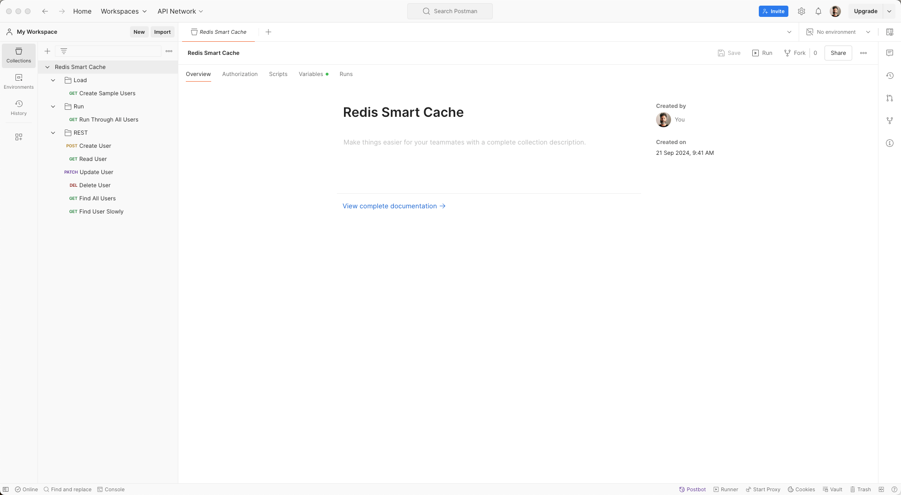
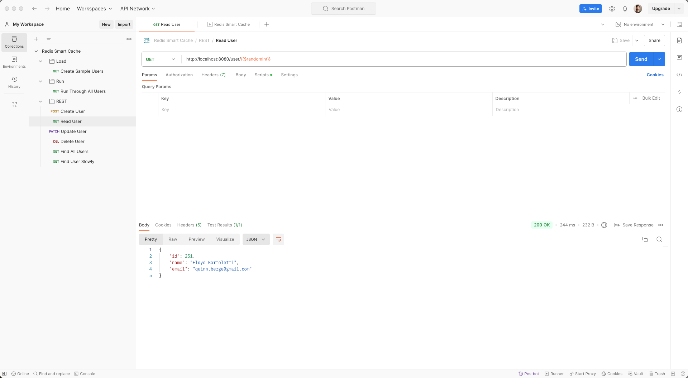
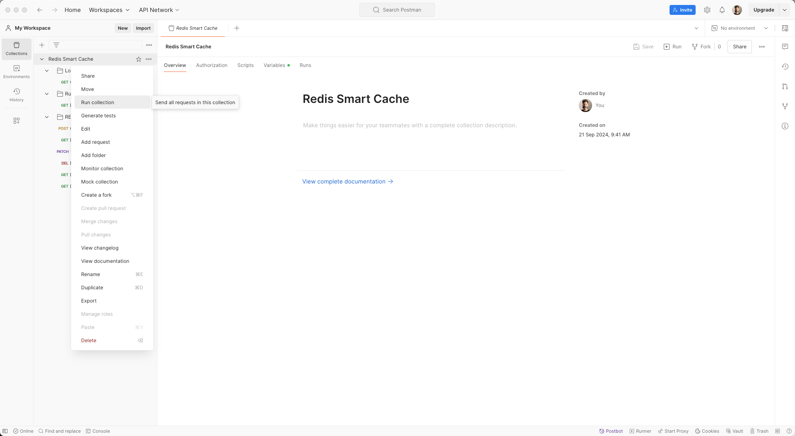
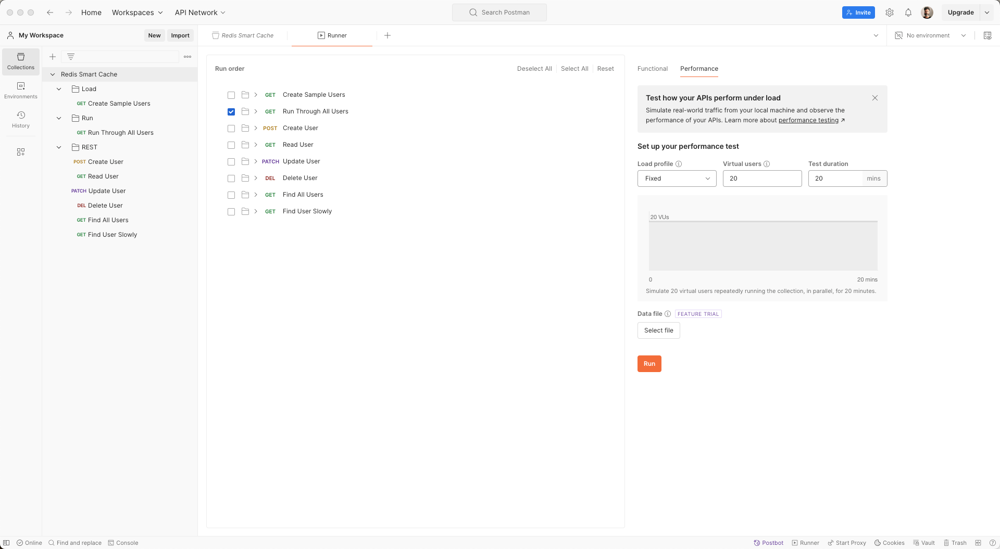
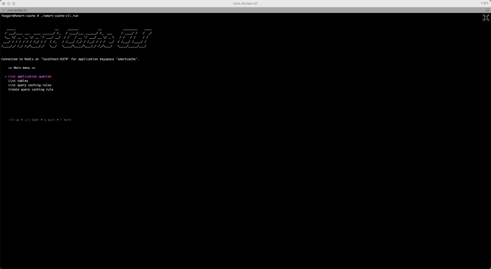
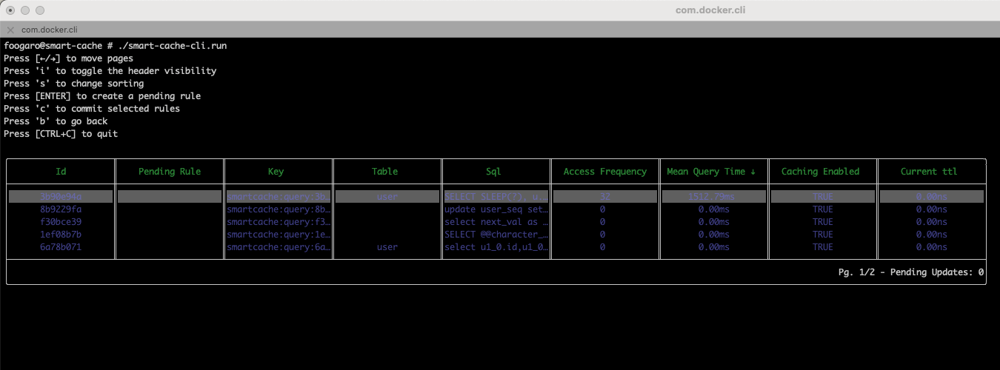
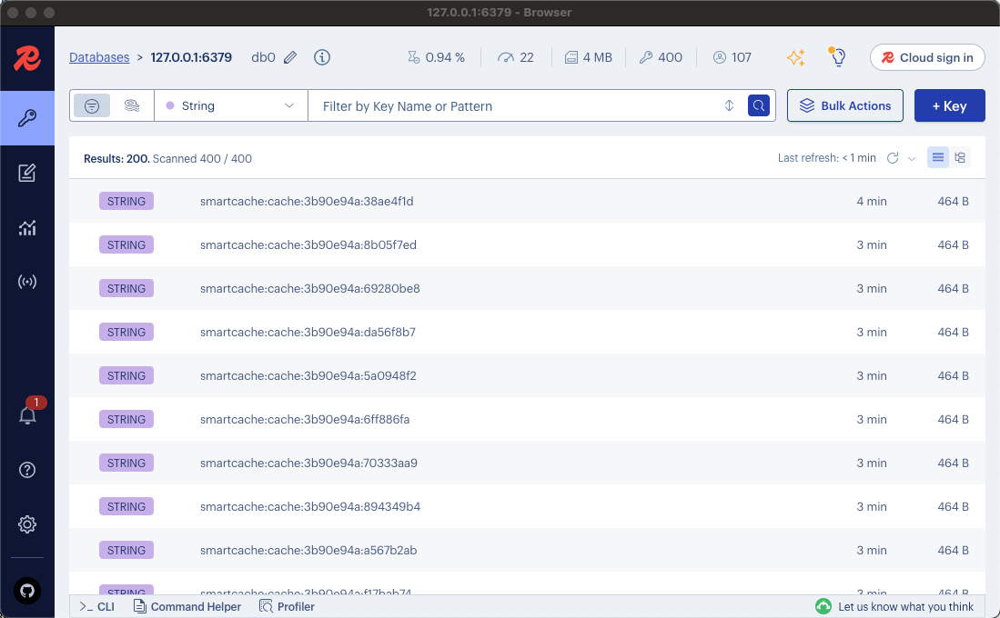
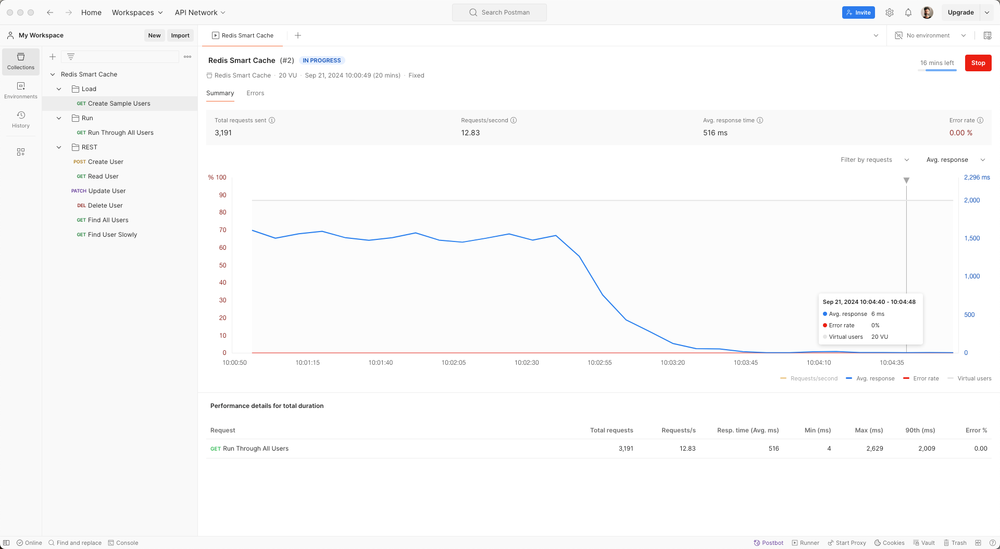
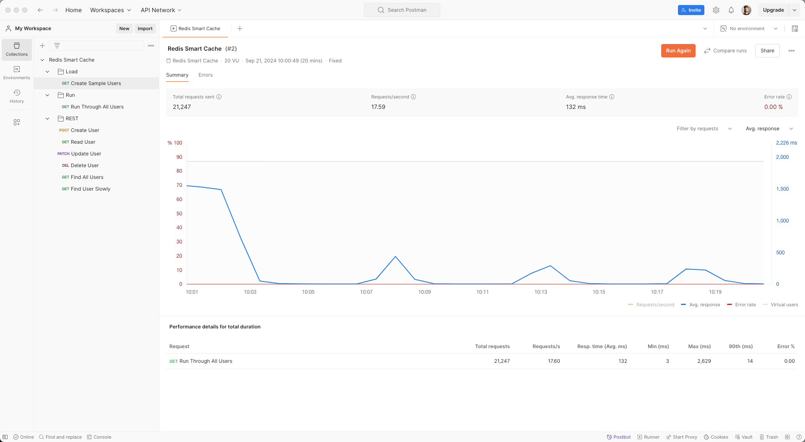
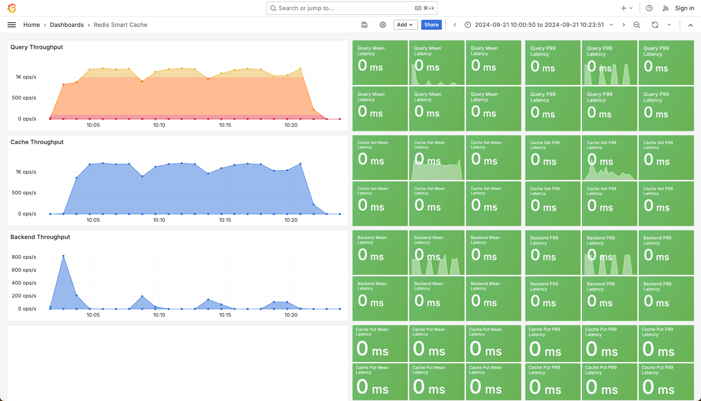

# Redis Smart-Cache

## Contesto

Oggi molte aziende stanno trasferendo i propri carichi di lavoro nel cloud, sia per le applicazioni che per le piattaforme dati. Tuttavia, esistono applicazioni che non sono completamente pronte per il cloud, spesso chiamate "legacy". Queste applicazioni, sviluppate anche decenni fa, non sono mai state aggiornate per vari motivi, accumulando così il cosiddetto debito tecnico.

Nonostante questo, il mercato, sia B2C che B2B, richiede sempre più velocità e prestazioni, imponendo standard anche per le applicazioni legacy. Uno dei requisiti fondamentali è la rapidità, con latenze che devono essere contenute nell'ordine di pochi millisecondi, se non meno.

Quando le condizioni lo permettono, è possibile mitigare queste difficoltà introducendo un sistema di cache tra l'applicazione e i dati. Redis Smart Cache risponde proprio a questa esigenza, ottimizzando l'accesso ai dati grazie alla velocità, flessibilità e scalabilità di Redis.

Redis Smart Cache funziona in modo efficace senza richiedere modifiche dirette al codice dell'applicazione legacy. Questo significa che non è necessario intervenire sul core dell'applicazione esistente. Le uniche modifiche richieste riguardano:

- la configurazione di alcuni parametri specifici;
- l'aggiunta della libreria Redis Smart Cache all'artefatto.

Per poter integrare Redis Smart Cache, l'unico requisito tecnico è che l'applicazione sia sviluppata in Java e che l'accesso ai dati avvenga attraverso la specifica JDBC (la specifica JPA usa JDBC).
In questo modo, è possibile ottimizzare le prestazioni senza stravolgere l'architettura esistente.

## Introduzione

In questo articolo verranno descritti i passaggi necessari per implementare la soluzione **Redis Smart Cache**. Inizieremo sviluppando un microservizio che accede ai dati utilizzando **JPA** (Java Persistence API), consentendo l'interazione con il database in modo efficiente. Successivamente, ci concentreremo sull'integrazione di **Redis Smart Cache** all'interno del microservizio, migliorando così le prestazioni complessive del sistema.

Per verificare l'efficacia della soluzione, utilizzeremo **Postman** per eseguire una serie di test che misureranno le performance applicative sia prima dell'integrazione della cache che dopo, mettendo in luce i benefici in termini di riduzione dei tempi di risposta e ottimizzazione delle risorse.

## Stack tecnologico
- OpenJDK 21 - la versione open-source di Java 21.
- Spring Boot - il framework utilizzato per sviluppare il microservizio.
- Spring Data - il framework che gestisce l'accesso ai dati secondo la specifica JPA.
- Redis Smart Cache - la libreria che aggiunge uno strato di cache alle applicazioni.
- Postman - il tool usato per eseguire test di performance sull'applicazione.
- Grafana - il tool che permette di monitorare l'accesso ai dati e le prestazioni.
- Redis - la piattaforma utilizzata per gestire la cache in modo efficiente.
- MySQL - il database utilizzato per la storicizzazione dei dati.
- Docker - tool per gestire ed eseguire applicazioni in container.

Mi pare che non manchi nulla, se non il vostro IDE preferito (quindi IntelliJ IDEA) e un'applicazione per il terminale.

# L'applicazione

Per l'occasione, ho sviluppato un microservizio per la gestione degli utenti (*User*) tramite un'interfaccia REST dedicata. È comunque possibile utilizzare un'applicazione esistente per eseguire i test, se già disponibile. La logica di integrazione con **Redis Smart Cache** rimane invariata.

## Dominio

Procediamo creando la nostra **Entity**, che sarà responsabile di mappare l'omonima tabella nel database **MySQL**. Questo ci permetterà di gestire le operazioni sui dati in modo strutturato e coerente all'interno della nostra applicazione, utilizzando il framework di persistenza **Spring Data**.

```java
@Entity
public class User {

    @Id
    @GeneratedValue(strategy= GenerationType.AUTO)
    private Long id;
    private String name;
    private String email;

    public Long getId() {
        return id;
    }

    public void setId(Long id) {
        this.id = id;
    }

    public String getName() {
        return name;
    }

    public void setName(String name) {
        this.name = name;
    }

    public String getEmail() {
        return email;
    }

    public void setEmail(String email) {
        this.email = email;
    }
}
```

Manteniamo l'approccio semplice e focalizzato, evitando complessità inutili, in quanto il nostro obiettivo principale è comprendere e implementare efficacemente l'integrazione con **Redis Smart Cache**.

## Repository

Sfruttiamo **Spring Data** per semplificare e rendere più efficiente lo sviluppo del nostro codice.

```java
public interface UserRepository extends ListCrudRepository<User, Long> {

    @Query(value = "SELECT SLEEP(?1), u.id, u.name, u.email FROM user u WHERE u.id = ?2", nativeQuery = true)
    public User findOneSlowly(Integer sleepy, Long id);

}
```

In questo caso, ho utilizzato l'annotation **@Query** per implementare il codice SQL necessario a simulare una query lenta. La funzione **SLEEP** introduce una pausa direttamente a livello di database; utilizzare un **Thread.sleep()** in Java avrebbe invece simulato un'attesa lato applicazione, fornendo quindi dati non accurati durante le misurazioni delle performance.

## Service

Procediamo ora a creare la classe che implementerà la nostra logica di business.

```java
@Service
public class UserService {

	private Logger logger = LoggerFactory.getLogger(getClass());
	private static final Random RANDOM = new Random();
	public static final int MAX_SLEEPY = 2;
	public static final long MAX_USERID = 1000;

	@Autowired
	private UserRepository userRepository;

	public User create(User user) {
		return userRepository.save(user);
	}

	public Optional<User> read(Long userId) {
		return userRepository.findById(userId);
	}

	public User update(User user) {
		return userRepository.save(user);
	}

	public void delete(Long userId) {
		userRepository.deleteById(userId);
	}

	public List<User> findAll() {
		return userRepository.findAll();
	}

	public User findOneSlowly() {
		int sleepy = RANDOM.nextInt(1, MAX_SLEEPY + 1);
		long userId = RANDOM.nextLong(1, MAX_USERID);
		return findOneSlowly(sleepy, userId);
	}

	public User findOneSlowly(int sleepy, long userId) {
		logger.info("Find One - sleepy: {} - userId: {}", sleepy, userId);
		return userRepository.findOneSlowly(sleepy, userId);
	}

	public void run() {
		logger.info("Executing through...");
		try (var executor = Executors.newVirtualThreadPerTaskExecutor()) {
			long maxUserId = UserService.MAX_USERID;

			for (int j = 0; j < maxUserId; j++) {
				int finalJ = j;
				executor.submit(() -> {
					try {
						findOneSlowly(1, finalJ);
						if (finalJ % 10 == 0) {
							logger.info("Execute through {} users", finalJ);
						}
					} catch (Exception e) {
						logger.error("Error while executing through for sleepy: 1, userId: {}", finalJ, e);
					}
				});
				executor.submit(() -> {
					try {
						findOneSlowly(2, finalJ);
						if (finalJ % 10 == 0) {
							logger.info("Execute through {} users", finalJ);
						}
					} catch (Exception e) {
						logger.error("Error while executing through for sleepy: 2, userId: {}", finalJ, e);
					}
				});
			}
			executor.shutdown();
			executor.awaitTermination(60, TimeUnit.MINUTES);
		} catch (InterruptedException e) {
			throw new RuntimeException(e);
		}
		logger.info("Executing through...DONE!");
	}

	public void load() {
		Faker faker = new Faker();
		logger.info("Creating users...");
		var range = LongStream.rangeClosed(1, MAX_USERID);
		range.parallel().forEach(j -> {
			User user = new User();
			try {
				user.setName(faker.name().fullName());
				user.setEmail(faker.internet().emailAddress());
				create(user);
			} catch (Exception e) {
				logger.error("Error while creating new user: {}", user, e);
			}
		});
		logger.info("Creating users DONE!");
	}
}
```

I primi cinque metodi riflettono lo standard per la gestione di qualsiasi risorsa nello stile **REST**, includendo operazioni come creazione, lettura, aggiornamento e cancellazione. Questi metodi assicurano che l'applicazione possa eseguire tutte le funzionalità fondamentali necessarie per manipolare le risorse utente.

I metodi `findOneSlowly`, sono stati introdotti appositamente per testare la query lenta che abbiamo implementato. Questo ci permetterà di analizzare le prestazioni dell'applicazione e di valutare l'efficacia dell'integrazione con **Redis Smart Cache** nel migliorare i tempi di risposta.

Infine, i metodi `load` e `run` sono metodi di utilità implementati ripettivamente per popolare il database con dati iniziali e per eseguire la query lenta su ogni record presente.


## Controller

L'ultimo componente da implementare è l'interfaccia **REST** per la gestione delle richieste **HTTP**. 

```java
@RestController
@RequestMapping("/user")
public class UserController {

    @Autowired
    private UserService userService;

    @PostMapping(path="/")
    public ResponseEntity<User> create(@RequestBody User user) {
        return ResponseEntity.ok(userService.create(user));
    }

    @GetMapping(path="/{id}")
    public ResponseEntity<User> read(@PathVariable("id") Long userId) {
        return userService.read(userId)
                .map(ResponseEntity::ok)
                .orElseGet(() -> ResponseEntity.notFound().build());
    }

    @PatchMapping(path="/")
    public ResponseEntity<User> update(@RequestBody User user) {
        return ResponseEntity.ok(userService.update(user));
    }

    @DeleteMapping(path="/{id}")
    public ResponseEntity<User> delete(@PathVariable("id") Long userId) {
        userService.delete(userId);
        return ResponseEntity.noContent().build();
    }

    @GetMapping(path="/")
    public @ResponseBody List<User> getAllUsers() {
        return userService.findAll();
    }

	@GetMapping(path="/{id}/{sleepy}")
	public ResponseEntity<User> findOneSlowly(@PathVariable("id") Long userId, @PathVariable("sleepy") int sleepy) {
		return ResponseEntity.ok(userService.findOneSlowly(sleepy, userId));
	}

	@GetMapping(path="/load")
	public ResponseEntity load() {
		userService.load();
		return ResponseEntity.noContent().build();
	}

	@GetMapping(path="/run")
	public ResponseEntity run() {
		userService.run();
		return ResponseEntity.noContent().build();
	}

}
```

Analogamente a quanto fatto per il Service, i primi cinque metodi riflettono lo standard per la gestione di qualsiasi risorsa nello stile **REST**.
I metodi `findOneSlowly`, verrano utilizzati per testare la query lenta.
Infine, i metodi `load` e `run` espongo la logica implementata nella componente `USerService` per popolare il database e verificare la query lenta per ogni record inserito.

## application.properties

Questo è il file di configurazione di Spring che consente di definire le varie impostazioni, come la stringa di connessione al database, il driver JDBC da utilizzare e altre configurazioni. 

```properties
spring.application.name=smart-cache
server.port=8080

spring.datasource.driver-class-name=com.mysql.cj.jdbc.Driver
spring.datasource.url=jdbc:mysql://localhost:3306/redis?serverTimezone=UTC
spring.datasource.username=redis
spring.datasource.password=redis

spring.jpa.hibernate.ddl-auto=update
spring.jpa.properties.hibernate.jdbc.time_zone=UTC
spring.jpa.show-sql=false
spring.jpa.properties.hibernate.format_sql=false
spring.jpa.open-in-view=false

spring.jackson.default-property-inclusion=always
```

Con ciò, abbiamo completato l'implementazione del microservizio di demo.

# MySQL

MySQL non ha bisogno di grandi presentazioni, né lo richiede la modalità con cui lo utilizzeremo, ovvero tramite **Docker**.
Utilizzeremo infatti un container Docker per eseguire MySQL, semplificando così il processo di configurazione e gestione del database nel nostro ambiente di sviluppo.

Quindi, pronti via:

```shell
docker run -it --rm=true --name=mysql -e MYSQL_DATABASE=redis -e MYSQL_USER=redis -e MYSQL_PASSWORD=redis -e MYSQL_ROOT_PASSWORD=root -p 3306:3306 mysql:8.4.2
```

Una nota importante: l'immagine Docker di **MySQL** mette a disposizione una serie di variabili d'ambiente che consentono di modificare le configurazioni di default. Ad esempio, è possibile definire il database iniziale da creare (`MYSQL_DATABASE`) e specificare le credenziali da utilizzare (`MYSQL_USER`, `MYSQL_PASSWORD`, `MYSQL_ROOT_PASSWORD`). Il resto delle impostazioni è standard, come l'esposizione della porta e la specifica del nome e della versione dell'immagine Docker da utilizzare.

Mi raccomando di **non utilizzare mai** la versione `latest`; ciò che funziona oggi potrebbe non funzionare domani.

# Redis

Sebbene al momento non sia necessario utilizzare Redis, procediamo comunque ad avviarlo tramite Docker, esattamente come abbiamo fatto per MySQL.

Prima di lanciare il container, dobbiamo inserire nell'immagine di Redis lo strumento da linea di comando per **Redis Smart Cache**. Questo tool non modifica in alcun modo Redis, poiché è una componente esterna che utilizzeremo successivamente per l'integrazione finale. In questo modo, avremo tutto pronto per le fasi successive.

## Dockerfile

```dockerfile
FROM redis/redis-stack-server:7.2.0-v10

RUN apt update
RUN apt-get -y install wget
RUN wget https://github.com/redis-field-engineering/redis-smart-cache-cli/releases/download/v0.0.13/redis-smart-cache-cli_Linux_x86_64.tar.gz
RUN tar -xzvf redis-smart-cache-cli_Linux_x86_64.tar.gz
RUN cp smart-cache-cli /usr/local/bin
RUN rm redis-smart-cache-cli_Linux_x86_64.tar.gz
```

Come potete osservare, il processo si limita a scaricare il tool per la CLI di **Redis Smart Cache** e a copiare l'eseguibile nella directory standard `/usr/local/bin`.

Procediamo con la build:

```shell
docker build -t foogaro/redis-smart-cache:1.0.0 -f Dockerfile.redis .
```

Procediamo ora ad avviare l'immagine Docker appena creata:

```shell
docker run -it --rm=true --name=redis-smart-cache -p 6379:6379 -p 8001:8001 foogaro/redis-smart-cache:1.0.0
```

# Docker

Procediamo a verificare lo stato dei container che abbiamo avviato. Dovremmo trovare attivi quelli relativi a **MySQL** e **Redis**, confermando così che entrambi i servizi sono in esecuzione:

```shell
foogaro@smart-cache # docker ps
CONTAINER ID   IMAGE                                     COMMAND                  CREATED       STATUS       PORTS                                            NAMES
b3030db5e7f6   mysql:8.4.2                               "docker-entrypoint.s…"   3 hours ago   Up 3 hours   0.0.0.0:3306->3306/tcp, 33060/tcp                mysql
71168615bf73   foogaro/redis-smart-cache:1.0.0           "/entrypoint.sh"         3 hours ago   Up 3 hours   0.0.0.0:6379->6379/tcp, 0.0.0.0:8001->8001/tcp   redis-smart-cache
```

A prescindere dagli ID dei container e dai tempi di esecuzione, dovreste trovarvi in una situazione analoga.

# Integrazione Redis Smart Cache

Per quanto riguarda **Redis**, la **CLI** `smart-cache-cli` è già pronta; non ci resta quindi che intervenire sulle configurazioni dell'applicazione e reimpacchettare il tutto.

## Libreria

Il codice del progetto del microservizio è gestito con **Maven**; pertanto, dobbiamo aggiungere il riferimento alla libreria di **Redis Smart Cache** come dipendenza all'interno del file `pom.xml`, come segue:

```xml
<dependency>
	<groupId>com.redis</groupId>
	<artifactId>redis-smart-cache-jdbc</artifactId>
	<version>0.3.3</version>
</dependency>
```

## Parametri di configurazione

Poiché il microservizio è sviluppato utilizzando il framework **Spring Boot**, è sufficiente modificare il file `application.properties` per integrare **Redis Smart Cache**.

Partiamo dalla configurazione originale:

```properties
spring.application.name=smart-cache
server.port=8080

spring.datasource.driver-class-name=com.mysql.cj.jdbc.Driver
spring.datasource.url=jdbc:mysql://localhost:3306/redis?serverTimezone=UTC
spring.datasource.username=redis
spring.datasource.password=redis

spring.jpa.hibernate.ddl-auto=update
spring.jpa.properties.hibernate.jdbc.time_zone=UTC
spring.jpa.show-sql=false
spring.jpa.properties.hibernate.format_sql=false
spring.jpa.open-in-view=false

spring.jackson.default-property-inclusion=always
```

E la aggiorniamo come segue:

```properties
spring.application.name=smart-cache
server.port=8080

spring.datasource.driver-class-name=com.redis.smartcache.Driver
spring.datasource.url=jdbc:redis://localhost:6379
spring.datasource.username=redis
spring.datasource.password=redis

spring.jpa.hibernate.ddl-auto=none
#spring.jpa.properties.hibernate.jdbc.time_zone=UTC
spring.jpa.show-sql=false
spring.jpa.properties.hibernate.format_sql=false
spring.jpa.open-in-view=false

spring.jackson.default-property-inclusion=always

spring.datasource.hikari.pool-name=SmartCacheForMySQL
spring.datasource.hikari.connectionTimeout=20000
spring.datasource.hikari.maximumPoolSize=100
spring.datasource.hikari.data-source-properties.smartcache.driver.class-name=com.mysql.cj.jdbc.Driver
spring.datasource.hikari.data-source-properties.smartcache.driver.url=jdbc:mysql://localhost:3306/redis?serverTimezone=UTC
spring.datasource.hikari.data-source-properties.username=redis
spring.datasource.hikari.data-source-properties.password=redis
```

Pagina 12 de "La settimana enigmistica" sezione "Aguzza la vista!".

Nella prima parte, la definizione del datasource di **MySQL** è stata sostituita con il driver e la stringa di connessione di **Redis**, comprese le credenziali.

L'ulteriore modifica riguarda l'ultimo blocco di proprietà per `spring.datasource.hikari`, dove sono stati inseriti i riferimenti a **MySQL** del precedente blocco.

Quindi, sostanzialmente, cos'è **Redis Smart Cache**? È un **proxy JDBC**. Intercetta le chiamate JDBC, verifica la disponibilità dei dati in cache e in caso negativo inoltra le richieste al vero database di backend e memorizza la risposta in cache, così che alla successiva richiesta possa fornire i dati direttamente dalla cache invece che dal database.

È talmente semplice che mi chiedo come non ci abbia pensato prima e non l'abbia implementato io stesso! Vabbè, la prossima volta.

Fatto, finito.

Nel caso in cui **non** avessimo il codice sorgente a disposizione e quindi **non** potessimo ricompilare l'applicazione, ricordiamo che i file **JAR**, **WAR** ed **EAR** sono essenzialmente archivi **ZIP**. Possiamo quindi estrarre il contenuto, aggiungere la libreria necessaria nella directory appropriata, ad esempio **"WEB-INF/lib"**, aggiornare il file di configurazione per l'accesso ai dati e, in questo modo, il problema è risolto.

# Performance test

Essendo un'applicazione **Spring Boot** gestita con **Maven**, non è necessario dilungarsi in spiegazioni.
Sappiamo esattamente quali passi intraprendere per lanciare il servizio:

```shell
mvn clean package spring-boot:run
```

Escludendo i dettagli dei log di compilazione e build di **Maven**, questo è sostanzialmente l'output prodotto da **Spring Boot**:

```shell

  .   ____          _            __ _ _
 /\\ / ___'_ __ _ _(_)_ __  __ _ \ \ \ \
( ( )\___ | '_ | '_| | '_ \/ _` | \ \ \ \
 \\/  ___)| |_)| | | | | || (_| |  ) ) ) )
  '  |____| .__|_| |_|_| |_\__, | / / / /
 =========|_|==============|___/=/_/_/_/

 :: Spring Boot ::                (v3.3.2)

2024-09-21T14:29:30.315+02:00  INFO 16025 --- [smart-cache] [           main] com.foogaro.trc.SmartCacheApplication    : Starting SmartCacheApplication using Java 21.0.2 with PID 16025 (/Users/foogaro/Dropbox/foogaro/RedisLabs/projects/GITHUB/smart-cache/target/classes started by foogaro in /Users/foogaro/Dropbox/foogaro/RedisLabs/projects/GITHUB/smart-cache)
2024-09-21T14:29:30.323+02:00  INFO 16025 --- [smart-cache] [           main] com.foogaro.trc.SmartCacheApplication    : No active profile set, falling back to 1 default profile: "default"
2024-09-21T14:29:31.338+02:00  INFO 16025 --- [smart-cache] [           main] .s.d.r.c.RepositoryConfigurationDelegate : Bootstrapping Spring Data JPA repositories in DEFAULT mode.
2024-09-21T14:29:31.510+02:00  INFO 16025 --- [smart-cache] [           main] .s.d.r.c.RepositoryConfigurationDelegate : Finished Spring Data repository scanning in 161 ms. Found 1 JPA repository interface.
2024-09-21T14:29:32.427+02:00  INFO 16025 --- [smart-cache] [           main] o.s.b.w.embedded.tomcat.TomcatWebServer  : Tomcat initialized with port 8080 (http)
2024-09-21T14:29:32.441+02:00  INFO 16025 --- [smart-cache] [           main] o.apache.catalina.core.StandardService   : Starting service [Tomcat]
2024-09-21T14:29:32.441+02:00  INFO 16025 --- [smart-cache] [           main] o.apache.catalina.core.StandardEngine    : Starting Servlet engine: [Apache Tomcat/10.1.26]
2024-09-21T14:29:32.511+02:00  INFO 16025 --- [smart-cache] [           main] o.a.c.c.C.[Tomcat].[localhost].[/]       : Initializing Spring embedded WebApplicationContext
2024-09-21T14:29:32.512+02:00  INFO 16025 --- [smart-cache] [           main] w.s.c.ServletWebServerApplicationContext : Root WebApplicationContext: initialization completed in 2065 ms
2024-09-21T14:29:33.121+02:00  INFO 16025 --- [smart-cache] [           main] o.hibernate.jpa.internal.util.LogHelper  : HHH000204: Processing PersistenceUnitInfo [name: default]
2024-09-21T14:29:33.215+02:00  INFO 16025 --- [smart-cache] [           main] org.hibernate.Version                    : HHH000412: Hibernate ORM core version 6.5.2.Final
2024-09-21T14:29:33.259+02:00  INFO 16025 --- [smart-cache] [           main] o.h.c.internal.RegionFactoryInitiator    : HHH000026: Second-level cache disabled
2024-09-21T14:29:33.757+02:00  INFO 16025 --- [smart-cache] [           main] o.s.o.j.p.SpringPersistenceUnitInfo      : No LoadTimeWeaver setup: ignoring JPA class transformer
2024-09-21T14:29:33.812+02:00  INFO 16025 --- [smart-cache] [           main] com.zaxxer.hikari.HikariDataSource       : SmartCacheForMySQL - Starting...
SLF4J(W): No SLF4J providers were found.
SLF4J(W): Defaulting to no-operation (NOP) logger implementation
SLF4J(W): See https://www.slf4j.org/codes.html#noProviders for further details.
2024-09-21T14:29:35.749+02:00  INFO 16025 --- [smart-cache] [           main] c.r.s.s.c.r.s.core.StreamConfigManager   : Updated configuration id 1726905762644-0: RulesetConfig [rules=[RuleConfig [tables=null, tablesAny=null, tablesAll=null, regex=null, queryIds=[3b90e94a], ttl=5.00m], RuleConfig [tables=null, tablesAny=null, tablesAll=null, regex=null, queryIds=null, ttl=0.00ns]]]
2024-09-21T14:29:35.813+02:00  INFO 16025 --- [smart-cache] [           main] c.r.s.s.i.m.c.i.push.PushMeterRegistry   : publishing metrics for RedisTimeSeriesMeterRegistry every 1m
2024-09-21T14:29:35.831+02:00  INFO 16025 --- [smart-cache] [           main] c.r.s.s.i.m.c.i.push.PushMeterRegistry   : publishing metrics for RediSearchMeterRegistry every 1m
2024-09-21T14:29:35.882+02:00  INFO 16025 --- [smart-cache] [           main] com.zaxxer.hikari.pool.HikariPool        : SmartCacheForMySQL - Added connection com.redis.smartcache.jdbc.SmartConnection@192b76a4
2024-09-21T14:29:35.884+02:00  INFO 16025 --- [smart-cache] [           main] com.zaxxer.hikari.HikariDataSource       : SmartCacheForMySQL - Start completed.
2024-09-21T14:29:37.122+02:00  INFO 16025 --- [smart-cache] [           main] o.h.e.t.j.p.i.JtaPlatformInitiator       : HHH000489: No JTA platform available (set 'hibernate.transaction.jta.platform' to enable JTA platform integration)
2024-09-21T14:29:37.128+02:00  INFO 16025 --- [smart-cache] [           main] j.LocalContainerEntityManagerFactoryBean : Initialized JPA EntityManagerFactory for persistence unit 'default'
2024-09-21T14:29:37.475+02:00  INFO 16025 --- [smart-cache] [           main] o.s.d.j.r.query.QueryEnhancerFactory     : Hibernate is in classpath; If applicable, HQL parser will be used.
2024-09-21T14:29:38.211+02:00  INFO 16025 --- [smart-cache] [           main] o.s.b.a.e.web.EndpointLinksResolver      : Exposing 1 endpoint beneath base path '/actuator'
2024-09-21T14:29:38.321+02:00  INFO 16025 --- [smart-cache] [           main] o.s.b.w.embedded.tomcat.TomcatWebServer  : Tomcat started on port 8080 (http) with context path '/'
2024-09-21T14:29:38.340+02:00  INFO 16025 --- [smart-cache] [           main] com.foogaro.trc.SmartCacheApplication    : Started SmartCacheApplication in 8.681 seconds (process running for 9.392)
```

## Caricamento dei dati

Per il caricamento dei dati, ho predisposto un endpoint REST `/user/load` che crea una serie di oggetti **User** con valori fittizi generati tramite **JavaFaker**, inserendoli nel database tramite il repository.

Per eseguire questa operazione, abbiamo due opzioni: utilizzare **curl** oppure **Postman**.

Dato che successivamente utilizzeremo **Postman** per verificare l'integrazione con **Redis Smart Cache**, inizieremo direttamente con questo strumento.

Se Postman non hai, al seguente link lo troverai:
- [https://www.postman.com/downloads/](https://www.postman.com/downloads/)

Dopo aver scaricato e installato lo strumento sul vostro sistema operativo di sviluppo (ad esempio Linux o macOS), avviatelo e importate la mia Postman Collection in formato JSON disponibile al seguente link:
- [Redis Smart Cache.postman_collection.json](Redis Smart Cache.postman_collection.json)

Al termine del processo di importazione, dovreste ottenere una collezione simile alla seguente:

<p align="center"></p>

Selezionare sotto la cartella _Load_ l'endpoint _GET Create Sample Users_ e premete il tasto _Send_.

Questa azione invocherà una richiesta HTTP di tipo GET verso l'endpoint [http://localhost:8080/user/load](http://localhost:8080/user/load), che verrà presa in carcio dallo `UserController`, che la invierà allo `UserService`, che la invierà allo `UserRepository`, che al mercato mio padre comprò!

Al termine di questo processo, il database dovrebbe contenere circa 100 o 1.000 utenti (non ricordo esattamente quale valore massimo ho impostato).
Utilizzando **Postman**, possiamo invocare il metodo **GET Read User** presente nella cartella **REST**.
Gli utenti sono stati inseriti progressivamente a partire dall'ID "1", quindi è possibile verificare il valore di un utente con un determinato ID, come mostrato nella seguente immagine:

<p align="center"></p>

## Misurazione delle performance senza attivare Redis Smart Cache

Utilizzando **Postman**, procediamo a creare un test di performance. Per fare ciò, selezioniamo i tre punti "..." accanto alla nostra collezione **"Redis Smart Cache"** e scegliamo la voce **"Run collection"** dal menu contestuale che appare, come illustrato di seguito:

<p align="center"></p>

Selezioniamo il metodo o i metodi per i quali desideriamo eseguire il test di performance; nel nostro caso, il metodo **"Run Through All Users"**.
Nel pannello di destra, selezioniamo la scheda **"Performance"** e impostiamo il valore **"20"** sia per il parametro **"Virtual users"** che per **"Test duration"**.

In questo modo, 20 utenti virtuali invocheranno il metodo selezionato per la durata di 20 minuti.

<p align="center"></p>

Un intervallo di tempo così ampio ci permette di osservare le prestazioni senza cache e di avere il tempo necessario per attivarla, verificando se questo apporterà benefici.

Facciamo partire il performance test facendo click sul tasto _Run_ e verifichiamo che effettivamente le prime richieste vadano buon fine.

<p align="center"></p>

## Attivazione della cache da CLI

Apriamo un terminale ed eseguiamo il comando `smart-cache-cli.run`, che avvierà la console all'interno del container Redis, come illustrato di seguito:

<p align="center"></p>

Utilizzando i tasti freccia, selezioniamo la voce **List application queries**, che visualizzerà le query intercettate fino a quel momento:

<p align="center"></p>

Nel mio caso, la prima linea visualizzata corrisponde alla query *lenta*; si noti la funzione **SLEEP** nel testo del codice SQL.

Premendo il tasto **Enter**, entriamo nella modalità di impostazione del **Time-To-Live** (TTL) della cache, che attualmente è impostato a "0", indicando che la cache è disabilitata.

Inseriamo un valore di 5 minuti utilizzando la sintassi `5m` e premiamo **Enter**. Per confermare la modifica, premiamo il tasto **c** seguito dal tasto **y** per la conferma finale.

A partire da questo momento, ogni volta che viene eseguita la query per la quale abbiamo impostato un **Time-To-Live** (TTL), i dati verranno memorizzati nella cache.

Possiamo verificare l'effettiva presenza della query nella cache utilizzando **Redis Insight** e osservare il tempo rimanente prima che la query venga rimossa dalla cache.

<p align="center"></p>

Tornando su **Postman**, dovremmo iniziare a osservare che l'andamento del grafico delle richieste mostra una lieve flessione verso il basso, indicando che i tempi di risposta stanno diminuendo:

<p align="center"></p>

A questo punto, non ci resta che attendere il completamento del test per analizzare il risultato. Al termine dei 20 minuti, il grafico del test di performance in **Postman** dovrebbe apparire come segue:

<p align="center"></p>

È evidente come l'integrazione pianificata con Redis abbia portato benefici significativi. I tempi di risposta, che inizialmente avevano una media di circa 1,5 secondi, sono ora scesi a circa 132 millisecondi.

Inoltre, Redis Smart Cache espone le proprie metriche memorizzandole come data-point di serie temporali direttamente all'interno di Redis, rendendole utilizzabili da strumenti di monitoraggio come Grafana.
Per l'occasione, ecco una dashboard in formato JSON che potete importare direttamente in Grafana. 

- [grafana.dashboard.json](grafana.dashboard.json)

Per il test che abbiamo appena eseguito, ecco come la dashboard dovrebbe apparire:

<p align="center"></p>

La libreria **Redis Smart Cache** si è rivelata uno strumento estremamente flessibile e semplice da integrare nelle applicazioni esistenti.
Grazie alla sua natura di proxy JDBC, consente di ottimizzare le prestazioni senza richiedere modifiche sostanziali al codice sorgente.
Questa semplicità d'uso, unita alla capacità di ridurre significativamente i tempi di risposta e alla facilità di monitoraggio delle performance tramite strumenti come Grafana, rende **Redis Smart Cache** una soluzione altamente utile per migliorare l'efficienza e la reattività delle applicazioni basate su database.

Buona integrazione a tutti!